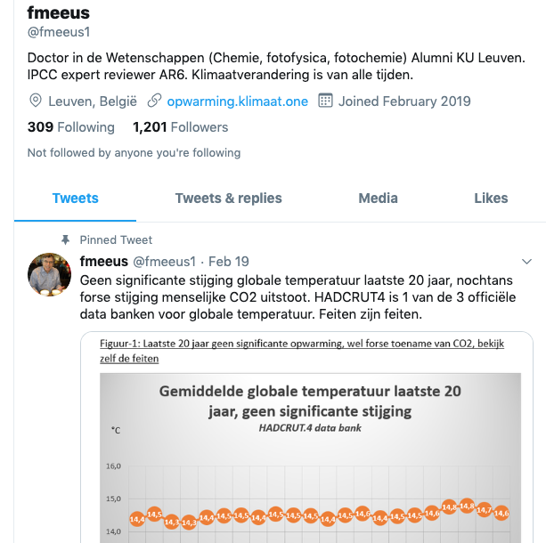
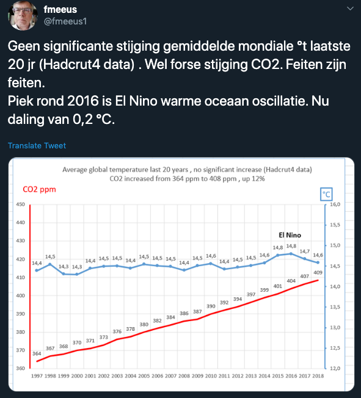

# climate-deny-debunk

Debunking climate deniers with [factfulness](https://www.gapminder.org/factfulness/) and simple statistics.

# First debunk 

Climate Denier: fmeeus1

If you plot the, TWICE badly graphed and cherrypicked, data below properly 

You still get an increasing trend with simple linear regression:

[Debunk 1 notebook here](fmeeus1.ipynb)

